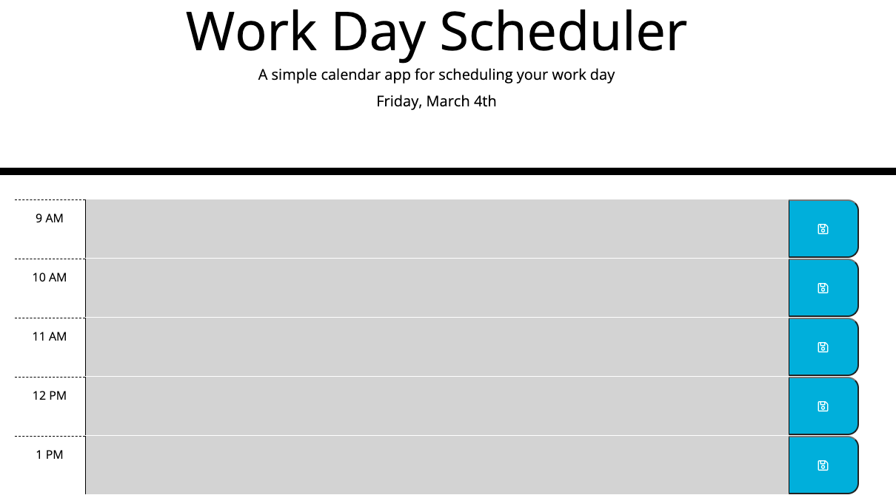

# Work Day Planner

## Table of Contents

1. [Description](#description)
2. [Visuals](#visuals)
3. [Deployment](#deployment)

## Description

In this project, HTML, CSS, Javascript, Jquery, and some Moment.js were used to create a daily work scheduler. It consists of a page divided up into rows which represent time blocks for every hour between 9-5. Within those time blocks, the user will find the time itself, a text area to enter information, and a save button to make sure that information remains in the block until they decide to change it. 

### It functions as such:

- user clicks inside the text area
- user enters task for that time period
- user clicks save button
- information is saved in local storage

## Visuals

## Deployment

[--> Link to live site <--](https://slwooten.github.io/daytime-planner/)